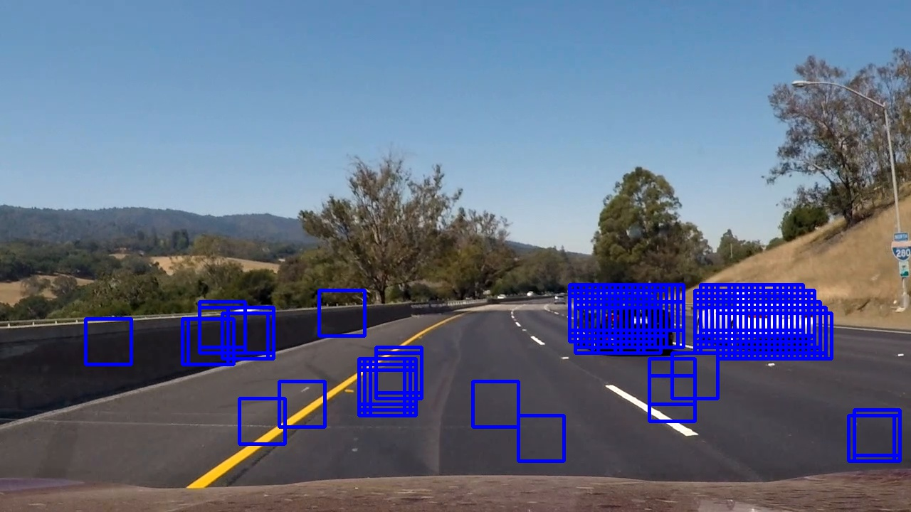
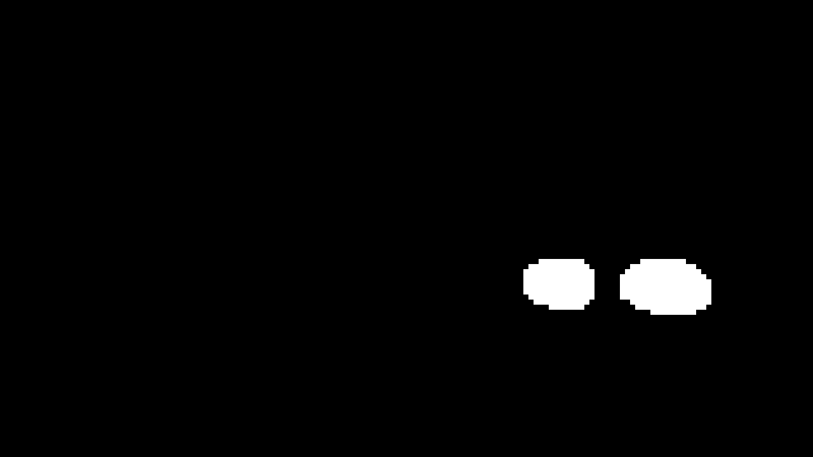
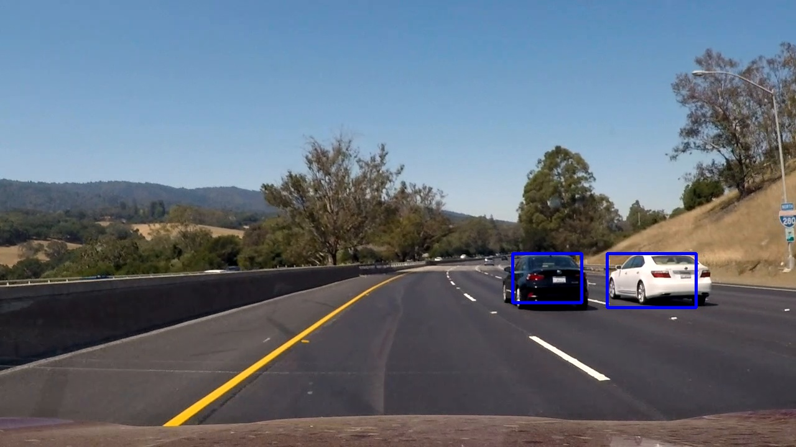

# Vehicle Detection and Tracking
Udacity Self-Driving Nano-Degree, Project 5

By Erwan Suteau, Aug 27, 2017

## Histogram of Oriented Gradients (HOG)

### Parameter Selection

The calculation of the histogram of oriented gradients is defined in the function get\_hog\_features() (line 28 of main.py).

The selection of parameters is based on trial and error. I started with the default parameters defined in the lesson, and then played around those values to see if the classifier would train better. I prioritized accuracy over speed.

I ended up with:

- Color Space: YUV
- Orientations: 11
- Pixels per cell:32x32
- Cells per Block: 2x2
- Transform Sqrt: False
- Block Norm: &#39;L2-Hys&#39;

&#39;YUV&#39; seems to perform better or equal to YCrCb. The classifier accuracy was significantly higher with one of those 2 color maps than the others.

I selected a different norm function that the default one (L1) because the skimage library will use the L2-Hys normalization method in the future. I did not seem to make a huge difference compared to L1 normalization.

I also disabled the square root transform because it was causing problems with some images during training, returning nan values for some small sections of the image.

### Feature Selection

In addition to the HOG features, I also used spatial features and color histograms. Combined together with HOG, they seem to produce an excellent set of inputs for the classifier to train on. The classifier performed much better with all 3 combined.

### Classifier

Classifier training can be found in function run\_classifier(), line 344 of main.py

I chose Linear Support Vector Classification for this project, as it gave me around 99% of accuracy on the test set. 
I used almost the entirety of the smaller training set provided by Udacity: 8792 images for each dataset (car and non-cars).

To get good results I madee sure to normalize the dataset to zero mean and unit variance using the StandardScaler() class. (See function prepare\_feature(), line 320 of main.py).

Finally, the dataset was separated into a training set (80%) and a test set (20%). I used the built in score function on the latest to check the accuracy of my classifier.

## Sliding Window Search

### Implementation

My initial approach was the one introduced in the lesson, which for a given set of window size and stride, extracts all the window pixels from the original image and then calculate the feature maps (HOG, spatial and color histogram features). This was implemented in the find\_windows\_slow() function (line 837 of main.py)

I realized quickly that this approach was not very efficient, because with the window overlap we calculate multiple times the gradients at the same locations. I kept it in the code as it gave me a reference for creating a faster version of it.

To speed up computation, I implemented find\_windows\_fast() (line 804 of main.py), which calculates the HOG features only once, and then extract the pixels corresponding to each sliding window.

Finding the right parameters for car detection was tricky. First of all, you need to restrict the sliding window boundaries to avoid spending time outside of the road. I limited the search window to the lower portion of the image, with Y in [400, 656]

Then you want a window size that is not too big so that you can detect cars at the end of the road, but you also want to able to detect cars when they are close to the camera.

I played a lot with those parameters, using different window sizes (256x256, 192x192, 128x128, 96x96, 64x64), and using them together. In the end, a single window size of 64x64 gave me a good enough level of detection and helped speed up my calculations.

For overlap, I chose a stride of 1 cell, which corresponds to 8 pixels. This is a small stride, but it gave me good results with the window of 64x64.

### Examples

After the window detection, we create a heat map by setting the pixels located inside each window to a value of 1 and summing over every window that was classified as a car.

Then we apply a threshold to remove false positive and keep the image patches with the most overlap. My final threshold was set to 10.

You can find below examples of my pipeline. This was produced on frame 935 of the test video. You can clearly see that the classifier detects false positives which are then discarded by the heat map thresholding, giving a pretty good detection of the car boundaries.

Figure 1: 64x64 Sliding Window Detection

Figure 2: Heat Map Thresholding

Figure 3: Final Boundaries drawn back on the original picture

## Video Implementation

### Results

The output video can be found in my github project, at the following link:
[https://github.com/esuteau/car\_vehicle\_detection/blob/master/output\_video.mp4](https://github.com/esuteau/car_vehicle_detection/blob/master/output_video.mp4)

Here is a preview of the video

### False Positive Filtering

With the video input feed, we know that there is a very high correlation between consecutive frames, meaning that the position of the vehicle will vary very slightly between them. The video input is at 30 frames/sec, and if you look at 1s of the video, you will see a very small difference between the initial and final positions of the car.

We can use this at our advantage to filter false positives better. What I did was a simple averaging of the heat map over 1s (30 frames). False positives, which could be considered as noise, would average out to a value close to zero, whereas the car positions would stay at a high value in the heat map.

If this average is not done efficiently computation wise, it could slow down significantly the pipeline. To do it properly, you need a few things:

- Store the 30 consecutive images: we use collections.deque container to do that efficiently, which if a FIFO of limited size.
- Do not calculate the average heat map by using the numpy.mean function over 30 images at each frame, this is slow and only gets slower as you increase the memory length. Instead, calculate the cumulative sum of the heat map, which requires subtracting and adding one image at every frame. Computation time stays constant as you increase the memory length. The process is the following: when the FIFO is full, subtract the first image of the queue before discarding it, then add the new image to calculate the cumulative sum.

## Discussion

The biggest hurdle I encountered during this project was just to wait for the results. Running this on a 6 year-old laptop did not help and I had to use a bunch of tricks and really think about computational efficiency to get the most of it.

My best friend in this process was the pickle module. I used it to store anything I did not have to recalculate, like for example the SVC classifier, but even the detected windows. Storing the window positions could let me iterate quickly with different memory length and heat map thresholds without having to go through the entire pipeline again.

The final video is satisfying, but it could still be enhanced.

I think we can do a much better job with the classifier. Even though I have a high accuracy on the training set, I realized that many false positive are still detected.

Here I see different options:

1. Use a Convolutional Neural net to detect cars. This should improve the accuracy of the classifier and thus help with detection
2. Use the additional datasets available to train of more samples. Hopefully this could help generalize a lot better and help detection.

Also some work could be done to find the right tradeoff between computation speed and accuracy. This pipeline should run in real time on a car, so optimizing this algorithm for speed would make a lot of sense. (Also using better hardware and doing operations in parallel with graphics cards or FPGA could help)